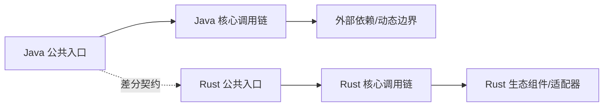

# weixin-java-common Java → Rust 全量迁移路线图

> 生成日期：2026-08-01
> Java 基线：`a49d6e1461752c06b752d2afd8aeeb7e6e78cefe`
> Rust 基线：`2026-08-01 working-tree（非 git 仓库；crates/wx-rust-common 105 个 src 文件 + 5 个集成测试文件）`
> 最近按 Rust 基线审计：2026-08-01（B2 批次 1 测试门禁通过：`cargo test -p wx-rust-common --all-features` 83/83；`cargo llvm-cov` line 26.07% / fn 50.28% / region 19.46%；详见《迁移测试对照表》与《覆盖审计报告》）
> 文档状态：`B2-PART1-TESTED`（批次 1 实现与测试完成；V5 集成与 Java 侧测试执行未做）
> Java 模块：`/Users/wandl/workspaces/workspace-github/WxJava/weixin-java-common`
> Java 包根：`/Users/wandl/workspaces/workspace-github/WxJava/weixin-java-common/src/main/java/me/chanjar/weixin/common`
> Rust 目标：`crates/wx-rust-common`
> 维护规则：本文档必须与对象表、语义表、名称检查及代码在同一变更中更新。

<!-- current-migration-contract-start -->
## 当前迁移规范执行口径

- 本文是当前权威路线图，必须以对象台账的当前事实为输入；模板生成仅代表 `DRAFT`。
- 路径算法为从 `/Users/wandl/workspaces/workspace-github/WxJava/weixin-java-common/src/main/java/me/chanjar/weixin/common` 起保留末 `2` 层包目录；优先修复 `MISPLACED`，再处理 `MISSING`、`STUB`/`PARTIAL` 和 `UNVERIFIED`。
- 依赖复用不改变 Spring/Java 的结构主线；只有精确符号、版本/提交、本地适配器和集成测试齐全时才能标 `DEPENDENCY_REUSED`。
- 测试通过、覆盖率或编译成功不能覆盖未完成对象；存在任一严格阻断状态时，不得宣称模块完成。
- 旧版路线图的有效设计内容合并到本文历史附录，当前源码和工作树重算的计划在前。
<!-- current-migration-contract-end -->

## 一、迁移目标与边界

### 总目标

- **公共 API 对齐**：`me.chanjar.weixin.common.*` 全部 174 个 Java 对象迁移为 `wx-rust-common` crate，接口、方法、参数语义一致（Rust 惯用命名，不机械翻译 JavaBean）。
- **行为对齐**：错误模型（`WxError`/`WxErrorException`）、access_token 双重检查锁获取、请求执行引擎（指数退避重试 + token 自动单次刷新）、消息重复检查、会话管理、OAuth2/OCR/图片处理服务语义一致。
- **序列化对齐**：Gson 手写 TypeAdapter 全部以 `serde` 派生替代，但线格式（JSON 字段名、可选字段、null 省略）逐字段对齐。
- **并发对齐**：`Lock` → `tokio::sync::Mutex`、`ExecutorService` → `tokio::task::spawn`、`Thread.sleep` → `tokio::time::sleep`。
- **生产替代目标**：纯 Rust + reqwest，无 FFI、无 `unsafe`（`#![forbid(unsafe_code)]`），MSRV 1.85 / Edition 2024。

### 纳入范围

| 范围 | Java 入口 | Rust 目标 | 完成标准 |
|---|---|---|---|
| 生产对象 | `weixin-java-common/src/main/java/me/chanjar/weixin/common/**`（174 对象） | `crates/wx-rust-common/src/**`（174 主文件） | 对象、方法、参数、逻辑可追溯 |
| 示例/脚本 | 模块内 example/demo 类（如 WxMpDemoServer 依赖的公共能力） | `examples/` + 集成测试 | 真实回放通过 |
| 测试/夹具 | `src/test/java`（29 个测试对象，含 WxError 序列化、消息重复检查、token 刷新并发测试） | `tests/` + 单元测试 | 镜像、golden/live 差分与 Rust 原生证据分层通过 |
| 宿主集成 | redis（重复检查）、HTTP 真实请求 | `wx-rust-common` + feature gate | 真实依赖集成通过 |

### 明确排除与受阻项

| 范围 | 状态 | 原因/依赖 | 是否暴露 | 覆盖率口径 | 退出条件 |
|---|---|---|---|---|---|
| `me.chanjar.weixin.common.util.http.{apache,hc,jodd,okhttp}` 三种 HTTP 后端 | `PLATFORM_NA` | 为 Java 不同 HTTP 客户端（Apache/OkHttp/Jodd）提供的适配实现；Rust 用 reqwest 统一 HTTP，多后端概念不适用 | 单列 | `PLATFORM_NA` | 提供 reqwest 统一实现证据 + 集成测试 |
| `me.chanjar.weixin.common.util.json.WxGsonBuilder` 及手写 TypeAdapter | `PLATFORM_NA` | Gson 专属序列化机制；Rust 以 `serde` 派生 + 自定义 `Serialize`/`Deserialize` 替代，线格式经 golden 夹具验证 | 单列 | `PLATFORM_NA` | serde 派生替代证据 + golden 差分测试 |
| `weixin-java-common` 内 GraalVM native-image 配置（META-INF/native-image） | `PLATFORM_NA` | GraalVM 原生镜像元数据，Rust 编译为原生二进制，无需该机制 | 单列 | `PLATFORM_NA` | — |

## 二、基线盘点

| 维度 | Java 当前值 | Rust 当前值 | 目标 | 证据命令/文件 |
|---|---:|---:|---:|---|
| 模块/crate | weixin-java-common | crates/wx-rust-common | 1:1 | `ls weixin-java-common` / `Cargo.toml` |
| 对象/主文件 | 174（146 类/8 枚举/19 接口/1 注解） | 0 | 174 | `scripts/inventory_java_objects.py --java-root /Users/wandl/workspaces/workspace-github/WxJava` |
| 公共方法/构造器 | javap 公共方法 1077（源声明 958，其余为 Object 继承与 Lombok getter/setter） | 0 | 全量 | `scripts/inventory_java_methods.py`（JDK 8 javap） |
| 示例/脚本 | 0（common 无独立示例） | 0 | — | — |
| 测试 | 29 个测试对象（`find weixin-java-common/src/test -name '*.java'`） | 0 | 全量处置 | 测试三本账（SOURCE_PARITY/RUST_OBLIGATION/VALUE_ADD） |

> 每个统计值必须附可重放命令或机器可读清单。旧 SHA 的统计不得用于当前完成率。

## 三、设计原则

1. 功能语义与可观察行为对齐，实现方式 Rust 化。
2. 每个 Java 类、接口、枚举或 record 对应一个主要 `.rs` 文件。
3. 目录、文件、方法、参数使用 `snake_case`，类型使用 `PascalCase`。
4. `lib.rs`、`mod.rs` 只声明和重导出，不集中定义迁移对象。
5. 所有已有 Java 对象、构造器、方法、泛型/值参数、返回、异常、元数据标签和关键逻辑注释均迁移为可追溯的中文 Rust 文档。
6. 不删减已经可用的 Rust 实现；以增量补齐和兼容包装继续迁移。
7. 编译、登记、文件存在不等于行为完成。
8. 组件选型按语义合同、硬约束、风险 POC、共享合同测试和真实宿主证据晋级，不按 Java/Rust 框架名称机械替换。
9. Rust 对外 API 使用惯用命名；JavaBean、脚本属性或反射兼容由显式 registry/member resolver 适配，不机械生成 `get_*`。
10. `ADAPTED` 只表示映射方式，必须另行填写 `MISSING`、`UNVERIFIED`、`IMPLEMENTED` 等事实状态。
11. 迁移后的公开 API 遵守本地 `rust-api-design`：`get_*` 仅用于 lookup，转换按 `as_`/`to_`/`into_` 与 `From`/`TryFrom` 语义命名，禁止用 `Deref` 伪造继承。
12. 默认以完整 Java 源模块为一次迁移批次；实现阶段按依赖顺序连续完成全部语义迁移。
13. 禁止“迁移一个对象 → 比对一个对象 → 测试一个对象”的循环；全部实现冻结后再统一静态审计与验证。
14. 对象级行用于全量追踪和最终覆盖率核算，不作为实施中的验收检查点。
15. Java 源码决定对象边界和目标目录，Rust 依赖只决定真实逻辑的复用边界。
16. `DEPENDENCY_REUSED` 必须精确到 crate、版本/提交、上游源码符号、本地调用点和集成测试。
17. 仅 JVM、字节码、类加载器等不可迁移能力可标 `PLATFORM_NA`。

## 四、依赖与调用链



| 调用链 | Java 语义 | Rust 设计 | 动态边界 | 验证 |
|---|---|---|---|---|
| AccessToken 获取（模式 D） | 双重检查锁 + tryLock(100ms, 3s 超时) + 模板方法 doGetAccessTokenRequest | async fn get_access_token + `Mutex::try_lock().timeout()` + trait 模板方法 | 无（纯逻辑） | 并发差分测试（多任务同时刷新仅一次） |
| 请求执行引擎（模式 E） | execute/executeInternal：-1 指数退避重试（1s<<n, 5 次）+ token 过期自动单次刷新（doNotAutoRefresh 防递归） | async fn execute + `tokio::time::sleep` 退避 + loop 刷新 | 无 | 重试次数/间隔/刷新次数差分测试 |
| 消息重复检查 | WxMessageDuplicateChecker（内存/Redis 两实现） | trait + 内存实现（DashMap）+ redis feature | redis 连接 | redis 集成测试 |
| OAuth2 服务 | WxOAuth2Service 接口 + 实现 | async trait + reqwest | 微信 API | golden 差分 |

### 组件替换决策

| Java 职责 | 必须保持的合同 | 搜索词/来源/观察日期 | Rust 形态/候选 | 硬门禁 | 适配度/生态健康/置信度 | 依赖归属 | 采用状态 | 风险 POC/下一门禁 |
|---|---|---|---|---|---|---|---|---|
| Apache HttpClient / OkHttp / Jodd（HTTP 层） | 连接池、代理、超时（5s）、TLS、重定向、流式上传下载 | `reqwest rustls blocking`；crates.io 2026-07 观察 | direct crate | license Apache-2.0 / MSRV 1.85 / rustls 无 OpenSSL | 适配度高；reqwest 0.13 生态健康 | `wx-rust-common` | `CANDIDATE` → B1 阶段 `SPIKE_VERIFIED` | POC：代理+超时+流式上传真实请求 |
| Gson（JSON） | 字段名、null 省略、多态 TypeAdapter、@SerializedName | `serde_json`（preserve_order） | direct crate | license MIT/Apache-2.0 | 适配度高 | `wx-rust-common` | `CANDIDATE` | POC：WxError 等核心 bean 序列化 round-trip |
| Jedis / Redisson（Redis） | 重复检查、分布式锁 | `redis` crate | direct crate | license MIT | 适配中 | `wx-rust-common`（feature `redis`） | `CANDIDATE` | POC：WxMessageInRedisDuplicateChecker 语义 |
| SLF4J | 日志 | `tracing` + `tracing-subscriber` | direct crate | license MIT/Apache-2.0 | 适配高 | `wx-rust-common` | `CANDIDATE` | 日志字段/上下文对齐 |
| Joda-Time / java.util 时间 | 时间戳、过期时间计算 | `chrono` + std | std/direct | — | 适配高 | `wx-rust-common` | `CANDIDATE` | 时间边界测试 |

## 五、阶段总览

| 阶段 | 内容 | 状态 | 交付物 | 阶段出口 |
|---|---|---|---|---|
| B0 | 冻结全量基线、四文档和批次清单 | **规划完成**（本文档+对象表+语义表+名称检查已生成） | SHA a49d6e14、对象分母 174、方法分母待 javap 冻结 | 范围、合同、依赖顺序和口径锁定 |
| B1 | 锁定架构与组件替换 | 未开始 | `WxError`/`WxErrorException`/`WxService`/`WxConfigStorage`/`RequestExecutor` trait；reqwest+serde 决策 | 阻断性决策已解决或获批 |
| B2 | 一次性完成整批语义实现 | ✅ 批次 1 完成（2026-08-01） | 90 对象 `IMPLEMENTED` + 1 `DEPENDENCY_REUSED` + 87 `PLATFORM_NA` + 1 `RUST_EXTENSION`；83/83 测试 | cargo fmt/check/clippy/test 全绿；llvm-cov line 26.07% |
| V0 | 实现冻结与统一静态审计 | 未开始 | audit_migration_layout.py + 四文档回填 | 完整分母无遗漏、无 STUB |
| V1 | 统一工程验证 | ✅ 通过 | cargo fmt/check/clippy/test（83/83）+ llvm-cov 26.07%/50.28%/19.46% + 98 用例 98/98 处置 | 整批工程门禁通过（Java 侧测试未执行，需 JDK 8） |
| V2 | 统一行为验证 | 未开始 | Java 测试镜像 + golden 差分 | 行为合同通过 |
| V3 | 统一非功能验证 | 未开始 | 并发（token 刷新）、cargo-fuzz | 阈值通过 |
| V4 | 宿主、灰度与回滚 | 未开始 | redis 真实实例、微信沙箱 | 生产替代门禁通过 |

## 六、阶段任务

### 当前批次：weixin-java-common → crates/wx-rust-common（完整模块，首批）

| Java 对象/能力 | Rust 文件/能力 | 前置依赖 | 工作项 | 末端验收归属 | 状态 |
|---|---|---|---|---|---|
| `error.WxError` | `error/wx_error.rs` | 无 | 错误码模型、`from_json`、中文错误码翻译、`errorMsgEn` | V1 单测 + V2 golden | `MISSING` |
| `error.WxErrorException` | `error/wx_error_exception.rs` | `wx_error.rs` | checked 异常 → `thiserror` | V1 单测 | `MISSING` |
| `error.WxRuntimeException` | `error/wx_runtime_exception.rs` | `wx_error.rs` | 运行时异常 | V1 单测 | `MISSING` |
| `error.*ErrorMsgEnum`（5 个） | `error/*_error_msg_enum.rs` | 无 | 错误码枚举 | V1 单测 | `MISSING` |
| `api.WxConsts` | `api/wx_consts.rs` | 无 | 常量（含 `ACCESS_TOKEN_ERROR_CODES`） | V1 单测 | `MISSING` |
| `api.WxErrorExceptionHandler` | `api/wx_error_exception_handler.rs` | `wx_error.rs` | 异常处理器接口 | V1 单测 | `MISSING` |
| `api.WxMessageDuplicateChecker`（3 实现） | `api/wx_message_*_duplicate_checker.rs` | `redis` feature | 重复消息检查（内存单例/内存/Redis） | V1 单测 + V5 集成 | `MISSING` |
| `service.WxService` | `service/wx_service.rs` | `wx_error.rs` | 通用 get/post/upload 接口（async trait） | V1 单测 | `MISSING` |
| `service.WxOAuth2Service` | `service/wx_oauth2_service.rs` | `wx_service.rs` | OAuth2 授权接口 | V2 golden | `MISSING` |
| `service.WxOcrService` | `service/wx_ocr_service.rs` | `wx_service.rs` | OCR 服务接口 | V2 golden | `MISSING` |
| `service.WxImgProcService` | `service/wx_img_proc_service.rs` | `wx_service.rs` | 图片处理服务接口 | V2 golden | `MISSING` |
| `bean.WxAccessToken` | `bean/wx_access_token.rs` | 无 | token bean（序列化对齐） | V2 golden | `MISSING` |
| `bean.WxJsapiSignature` | `bean/wx_jsapi_signature.rs` | 无 | JSAPI 签名 bean | V2 golden | `MISSING` |
| `bean.WxOAuth2UserInfo` | `bean/wx_oauth2_user_info.rs` | 无 | OAuth2 用户信息 | V2 golden | `MISSING` |
| `bean.ToJson`/`CommonUploadParam` 等 | `bean/*.rs` | 无 | 上传参数等 | V2 golden | `MISSING` |
| `config`（ConfigStorage 抽象） | `config/wx_config_storage.rs` | `wx_error.rs` | token 缓存/过期/更新 + 锁（async trait） | V1 单测 + V3 并发 | `MISSING` |
| `session.WxSessionManager` | `session/wx_session_manager.rs` | 无 | 会话生命周期 | V1 单测 | `MISSING` |
| `util.http.RequestExecutor` 及 4 实现 | `util/http/request_executor.rs` 等 | reqwest | GET/POST/上传/下载执行器 | V1 单测 + V5 集成 | `MISSING` |
| `util.http.RequestHttp` | `util/http/request_http.rs` | reqwest | HTTP 客户端抽象（Rust 简化为 reqwest 持有） | V1 单测 | `MISSING` |
| `util.crypto.SHA1` | `util/crypto/sha1.rs` | sha1 crate | 签名校验 | V2 golden | `MISSING` |
| `util.RandomUtils`/`DataUtils` 等 | `util/*.rs` | 无 | 随机串/数据工具 | V1 单测 | `MISSING` |
| `redis` 相关（WxRedisOps 等） | `redis/*.rs` | `redis` feature | Redis 操作封装 | V5 集成 | `MISSING` |

> B2 实现期间不得逐行执行测试或升级为“已验收”。全部实现冻结后，在 V0
> 一次性完成静态对照并批量回填状态，再进入 V1–V4。

## 七、工程与质量门禁

以下命令只能在 B2 整批实现完成并冻结后统一执行，不得作为逐对象检查点：

```bash
cargo fmt --all --check
cargo check --workspace --all-targets --all-features
cargo test --workspace --all-targets --all-features
cargo clippy --workspace --all-targets --all-features -- -D warnings
```

**批次 1 执行结果（2026-08-01）**：

| 门禁 | 命令 | 结果 |
|---|---|---|
| 格式 | `cargo fmt --all --check` | 通过 |
| 编译 | `cargo check --workspace --all-targets --all-features` | 通过（零警告） |
| 测试 | `cargo test -p wx-rust-common --all-features` | **83/83 通过**（core_utils 11、source_parity_bean_error 17、source_parity_crypto_util 20、source_parity_fs_utils 6、rust_obligation_value_add 29） |
| lint | `cargo clippy --workspace --all-targets --all-features -- -D warnings` | 通过（零警告） |
| 覆盖率 | `cargo llvm-cov --workspace --all-features --summary-only`（rustc 1.97.1 + llvm-tools-preview；需 `PATH` 优先 rustup 工具链，Homebrew rustc 无 llvm-tools） | line 26.07% / fn 50.28% / region 19.46%（信号，非等价证明；明细 `覆盖率明细-2026-08-01.txt`） |
| Java 测试 | `JAVA_HOME=<corretto-8> mvn -pl weixin-java-common test` | **未执行**（JDK 21 + Lombok 1.18.30 编译失败 `TypeTag :: UNKNOWN`，需 JDK 8；留待工具链环境） |

补充门禁：

- 对象、方法、重载、参数差分；
- `SOURCE_PARITY`：每个 Java 测试/参数化用例都有处置，Java 镜像、golden 与 live 差分分别记录；
- `RUST_OBLIGATION`：所有权/Drop、async 取消、错误、serde、feature、宏、unsafe、组件和 adapter 等目标机制义务；
- `VALUE_ADD`：由分支、mutant、property、fuzz、事故、负载或安全风险驱动的增量测试；
- 组件替换的 manifest、POC、共享合同、真实宿主和生产状态分别记录；
- 真实脚本、并发、负载、fuzz、宿主、回滚证据；
- `lib.rs` / `mod.rs` / `compat.rs` 集中定义、通配导入和空实现检查。

## 八、风险与对策

| 风险 | 影响 | 触发信号 | 对策 | Owner |
|---|---|---|---|---|
| token 双重检查锁并发语义 | 多任务重复刷新 token，超 2000 次/日上限 | 并发测试出现 2 次以上刷新 | async `Mutex::try_lock` 超时抢锁 + 并发单测 | WxRust |
| Gson→serde 字段差异 | 微信 API 字段名/默认值/null 省略不匹配 | golden 差分失败 | 逐 bean 字段映射 + golden 夹具 | WxRust |
| reqwest 与 Apache 客户端行为差异 | 代理/超时/重定向语义不同 | 集成测试失败 | POC 先行 + 集成测试 | WxRust |
| 指数退避重试语义偏差 | 重试次数/间隔与 Java 不一致 | 重试差分测试失败 | 参数化差分测试（5 次、1s<<n） | WxRust |
| Redis 依赖（feature 门控） | 重复检查在无 Redis 时失效 | 集成测试失败 | feature 隔离 + 内存实现兜底 | WxRust |

## 九、完成定义

- [ ] 四文档与代码同步。
- [ ] 四文档使用相同 Java/Rust 基线，并记录最近审计日期；所有完成状态有当前 SHA 的证据锚点。
- [ ] 全量清单、语义合同和组件决策在编码前冻结。
- [ ] 所有非豁免对象先在 B2 一次性完成真实实现，期间未逐对象比对、测试或验收。
- [ ] V0 使用完整冻结分母完成一次统一静态审计，V1–V4 统一执行适用验证。
- [ ] 每个 Java 对象、方法、重载、参数都有明确去向。
- [ ] Java Getter/Setter 已映射为 Rust 惯用 API；需要兼容的字段、脚本或动态访问已标记 `ADAPTED` 并有双层测试。
- [ ] Java 对象/方法 JavaDoc、所有 `@param`、`@return`、`@throws`、元数据标签及关键行内注释均有 Rust 对应和来源锚点。
- [ ] `MISSING`、`MISPLACED`、`STUB`、`PARTIAL`、`UNVERIFIED` 均未计入已处理；阻塞原因只作为元数据。
- [ ] `DEPENDENCY_REUSED` 和 `PLATFORM_NA` 均有严格证据，未用相似能力模糊豁免。
- [ ] 高价值调用链完成语义迁移与差分验证。
- [ ] 每个第三方组件有合同、搜索词与观察日期、硬约束、同类候选相对评估、归属 crate、证据状态、淘汰理由、替代方案和退出策略。
- [ ] 镜像测试没有被标成 golden/live 差分。
- [ ] 每个 Java 测试有处置，Rust 特有义务已审计，增量测试能说明可捕获的缺陷。
- [ ] 真实脚本、并发、负载、安全、宿主和回滚门禁有证据或明确缺口。
- [ ] 最终报告分别给出结构、实现、行为、集成和生产就绪度。

<!-- historical-design-appendix-start -->
## 历史设计附录

<!-- 合并旧路线图仍有效的决策背景；历史里程碑、旧统计和旧完成状态不得覆盖当前路线图。 -->
