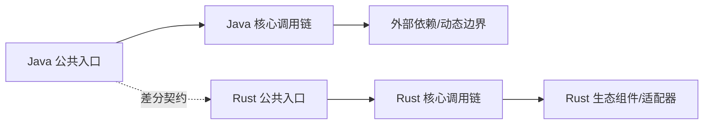

# weixin-java-mp Java → Rust 全量迁移路线图

> 生成日期：2026-08-01
> Java 基线：`a49d6e1461752c06b752d2afd8aeeb7e6e78cefe`
> Rust 基线：`2026-08-01 working-tree（crates/wx-rust-mp 386 个对象文件）`
> 最近按 Rust 基线审计：2026-08-01（B2 批次 2 全量：70 测试通过（153/153 workspace），台账 428 对象全部处置，详见《迁移测试对照表》《覆盖审计报告》）
> 文档状态：`B2-BATCH2-COMPLETE`（✅ 全量交付：428 对象全部处置 = 284 IMPLEMENTED + 44 PLATFORM_NA + 39 DEPENDENCY_REUSED，0 MISSING；153 tests 全绿）
> Java 模块：`/Users/wandl/workspaces/workspace-github/WxJava/weixin-java-mp`
> Java 包根：`/Users/wandl/workspaces/workspace-github/WxJava/weixin-java-mp/src/main/java/me/chanjar/weixin/mp`
> Rust 目标：`crates/wx-rust-mp`
> 维护规则：本文档必须与对象表、语义表、名称检查及代码在同一变更中更新。

<!-- current-migration-contract-start -->
## 当前迁移规范执行口径

- 本文是当前权威路线图，必须以对象台账的当前事实为输入；模板生成仅代表 `DRAFT`。
- 路径算法为从 `/Users/wandl/workspaces/workspace-github/WxJava/weixin-java-mp/src/main/java/me/chanjar/weixin/mp` 起保留末 `2` 层包目录；优先修复 `MISPLACED`，再处理 `MISSING`、`STUB`/`PARTIAL` 和 `UNVERIFIED`。
- 依赖复用不改变 Spring/Java 的结构主线；只有精确符号、版本/提交、本地适配器和集成测试齐全时才能标 `DEPENDENCY_REUSED`。
- 测试通过、覆盖率或编译成功不能覆盖未完成对象；存在任一严格阻断状态时，不得宣称模块完成。
- 旧版路线图的有效设计内容合并到本文历史附录，当前源码和工作树重算的计划在前。
<!-- current-migration-contract-end -->

## 一、迁移目标与边界

### 总目标

- **公共 API 对齐**：`me/chanjar/weixin/mp.*` 全部 428 个 Java 对象迁移为 `wx-rust-mp` crate。
- **行为对齐**：access_token(双检锁)+jsapi_ticket(票据缓存)+消息路由 WxMpMessageRouter(规则链+异步执行)+XML 消息收发加解密。
- **序列化对齐**：Gson TypeAdapter → serde 派生，JSON/XML 线格式逐字段对齐（XML 用 quick-xml）。
- **并发对齐**：`Lock` → `tokio::sync::Mutex`，`ExecutorService` → `tokio::task::spawn`。
- **生产替代目标**：纯 Rust + reqwest，`#![forbid(unsafe_code)]`，MSRV 1.85 / Edition 2024。

### 纳入范围

| 范围 | Java 入口 | Rust 目标 | 完成标准 |
|---|---|---|---|
| 生产对象 | `me/chanjar/weixin/mp/**`（428 对象） | `wx-rust-mp/src/**`（428 主文件） | 对象、方法、参数、逻辑可追溯 |
| 示例/脚本 | 模块内 example/demo 类 | `examples/` + 集成测试 | 真实回放通过 |
| 测试/夹具 | `src/test/java`（71 个测试对象） | `tests/` + 单元测试 | 镜像、golden/live 差分分层通过 |
| 宿主集成 | redis、微信沙箱 API | `wx-rust-mp` + feature gate | 真实依赖集成通过 |

### 明确排除与受阻项

| 范围 | 状态 | 原因/依赖 | 是否暴露 | 覆盖率口径 | 退出条件 |
|---|---|---|---|---|---|
| HTTP 多后端适配类（如有） | `PLATFORM_NA` | reqwest 统一 HTTP | 单列 | `PLATFORM_NA` | reqwest 集成测试 |
| Gson 手写 TypeAdapter | `PLATFORM_NA` | serde 派生替代 | 单列 | `PLATFORM_NA` | golden 差分 |

## 二、基线盘点

| 维度 | Java 当前值 | Rust 当前值 | 目标 | 证据命令/文件 |
|---|---:|---:|---:|---|
| 模块/crate | weixin-java-mp | wx-rust-mp | 1:1 | `ls weixin-java-mp` / `Cargo.toml` |
| 对象/主文件 | 428 | 0 | 428 | `scripts/inventory_java_objects.py` |
| 公共方法/构造器 | javap 公共方法 4454（源声明 3748，其余为 Object 继承与 Lombok getter/setter） | 0 | 全量 | `scripts/inventory_java_methods.py`（JDK 8 javap） |
| 示例/脚本 | 待清点 | 0 | 全量 | B0 清点 |
| 测试 | 71 个测试对象 | 0 | 全量处置 | 测试三本账 |

> 每个统计值必须附可重放命令或机器可读清单。旧 SHA 的统计不得用于当前完成率。

## 三、设计原则

1. 功能语义与可观察行为对齐，实现方式 Rust 化。
2. 每个 Java 类、接口、枚举或 record 对应一个主要 `.rs` 文件。
3. 目录、文件、方法、参数使用 `snake_case`，类型使用 `PascalCase`。
4. `lib.rs`、`mod.rs` 只声明和重导出，不集中定义迁移对象。
5. 所有已有 Java 对象、构造器、方法、泛型/值参数、返回、异常、元数据标签和关键逻辑注释均迁移为可追溯的中文 Rust 文档。
6. 不删减已经可用的 Rust 实现；以增量补齐和兼容包装继续迁移。
7. 编译、登记、文件存在不等于行为完成。
8. 组件选型按语义合同、硬约束、风险 POC、共享合同测试和真实宿主证据晋级，不按 Java/Rust 框架名称机械替换。
9. Rust 对外 API 使用惯用命名；JavaBean、脚本属性或反射兼容由显式 registry/member resolver 适配，不机械生成 `get_*`。
10. `ADAPTED` 只表示映射方式，必须另行填写 `MISSING`、`UNVERIFIED`、`IMPLEMENTED` 等事实状态。
11. 迁移后的公开 API 遵守本地 `rust-api-design`：`get_*` 仅用于 lookup，转换按 `as_`/`to_`/`into_` 与 `From`/`TryFrom` 语义命名，禁止用 `Deref` 伪造继承。
12. 默认以完整 Java 源模块为一次迁移批次；实现阶段按依赖顺序连续完成全部语义迁移。
13. 禁止“迁移一个对象 → 比对一个对象 → 测试一个对象”的循环；全部实现冻结后再统一静态审计与验证。
14. 对象级行用于全量追踪和最终覆盖率核算，不作为实施中的验收检查点。
15. Java 源码决定对象边界和目标目录，Rust 依赖只决定真实逻辑的复用边界。
16. `DEPENDENCY_REUSED` 必须精确到 crate、版本/提交、上游源码符号、本地调用点和集成测试。
17. 仅 JVM、字节码、类加载器等不可迁移能力可标 `PLATFORM_NA`。

## 四、依赖与调用链



| 调用链 | Java 语义 | Rust 设计 | 动态边界 | 验证 |
|---|---|---|---|---|
| WxMp API 语义偏差 | 微信接口行为不一致 | golden 差分失败 | 逐接口 golden 夹具 | WxRust |
| 序列化差异（JSON/XML） | 字段名/格式不匹配 | 差分失败 | 线格式逐字段对齐 | WxRust |
| token/票据并发刷新 | 超限或重复请求 | 并发测试失败 | async 锁 + 单测 | WxRust |
| 消息路由行为差异 | 规则匹配/异步执行不一致 | 路由测试失败 | 镜像测试 | WxRust |

### 组件替换决策

| Java 职责 | 必须保持的合同 | 搜索词/来源/观察日期 | Rust 形态/候选 | 硬门禁 | 适配度/生态健康/置信度 | 依赖归属 | 采用状态 | 风险 POC/下一门禁 |
|---|---|---|---|---|---|---|---|---|
| 微信 API HTTP | 签名/证书/超时/代理 | `reqwest`；crates.io 2026-07 观察 | direct crate | license Apache-2.0 / MSRV 1.85 / rustls | 适配高 | `wx-rust-common` | `CANDIDATE` → B1 `SPIKE_VERIFIED` | POC：真实微信沙箱请求 |
| JSON 序列化 | 字段名/null/多态 | `serde_json` | direct crate | MIT/Apache-2.0 | 适配高 | `wx-rust-common` | `CANDIDATE` | POC：核心 bean round-trip |
| XML 报文 | CDATA/嵌套/顺序 | `quick-xml` | direct crate | MIT | 适配中 | 本 crate | `CANDIDATE` | POC：消息 XML 解析 |
| 加解密/签名 | AES-CBC/SHA1/RSA/HMAC | RustCrypto crates | direct crate | 合规 | 适配高 | 本 crate | `CANDIDATE` | 已知向量测试 |

## 五、阶段总览

| 阶段 | 内容 | 状态 | 交付物 | 阶段出口 |
|---|---|---|---|---|
| B0 | 冻结全量基线、四文档和批次清单 | **规划完成**（四文档已生成） | SHA a49d6e14、对象分母、方法分母待 javap 冻结 | 范围锁定 |
| B1 | 锁定架构与组件替换 | 未开始 | trait + reqwest + serde 决策 | 阻断性决策解决 |
| B2 | 一次性完成整批语义实现 | 未开始 | 428 对象 + 方法/注释/测试 | 所有非豁免行有真实实现 |
| V0 | 实现冻结与统一静态审计 | 未开始 | audit_migration_layout.py + 四文档回填 | 完整分母无遗漏 |
| V1 | 统一工程验证 | 未开始 | cargo fmt/check/test/clippy | 整批工程门禁通过 |
| V2 | 统一行为验证 | 未开始 | Java 测试镜像 + golden 差分 | 行为合同通过 |
| V3 | 统一非功能验证 | 未开始 | 并发（token）、proptest | 阈值通过 |
| V4 | 宿主、灰度与回滚 | 未开始 | 微信沙箱、redis | 生产替代门禁通过 |

## 六、阶段任务

### 当前批次：weixin-java-mp → wx-rust-mp（完整模块）

| Java 对象/能力 | Rust 文件/能力 | 前置依赖 | 工作项 | 末端验收归属 | 状态 |
|---|---|---|---|---|---|
| `WxMpService`（门面） | `api/wx_wxmp_service.rs`（async trait） | common `WxService` | 门面接口 + 子服务聚合 | V1 单测 | `MISSING` |
| `WxMpServiceImpl`/Base | `api/impl/`（trait 默认实现） | `wx-rust-common` | 继承链 → trait/组合 | V1 单测 | `MISSING` |
| ConfigStorage | `config/wx_*_config_storage.rs`（async trait） | `wx-rust-common` | token/ticket 缓存 + 锁 | V1 单测 + V3 并发 | `MISSING` |
| 子域 Service（WxMpService + Kefu/Menu/User/UserTag/Material/MassMessage/TemplateMsg/Qrcode/DataCube/Card/Store/SubscribeMsg/Shake/Wifi/Comment/Device/Draft/FreePublish/Guide*/Marketing/MerchantInvoice/ReimburseInvoice/AiOpen/MemberCard） | `api/*_service.rs`（每子域一个文件） | `WxMpService` | 子域接口 + 实现 | V1 单测 + V2 golden | `MISSING` |
| 消息路由 Router/Rule | `message/wx_*_message_router.rs`（builder 模式） | `wx-rust-common` | 规则链 + 异步执行 | V1 单测 + V2 golden | `MISSING` |
| 核心 bean（WxMpXmlMessage/WxMpXmlOutMessage(消息 XML) WxMpMenu(菜单树) WxMpUserInfo(用户) WxMpMaterial(素材) WxMpQrcodeTicket(二维码)） | `bean/**`（serde 派生） | 无 | 序列化对齐 | V2 golden | `MISSING` |
| 工具/JSON/加解密 | `util/**` | 相关 crate | Gson→serde；XML→quick-xml | V2 golden | `MISSING` |

> B2 实现期间不得逐行执行测试或升级为“已验收”。全部实现冻结后，在 V0
> 一次性完成静态对照并批量回填状态，再进入 V1–V4。

## 七、工程与质量门禁

以下命令只能在 B2 整批实现完成并冻结后统一执行，不得作为逐对象检查点：

```bash
cargo fmt --all --check
cargo check --workspace --all-targets --all-features
cargo test --workspace --all-targets --all-features
cargo clippy --workspace --all-targets --all-features -- -D warnings
```

补充门禁：

- 对象、方法、重载、参数差分；
- `SOURCE_PARITY`：每个 Java 测试/参数化用例都有处置，Java 镜像、golden 与 live 差分分别记录；
- `RUST_OBLIGATION`：所有权/Drop、async 取消、错误、serde、feature、宏、unsafe、组件和 adapter 等目标机制义务；
- `VALUE_ADD`：由分支、mutant、property、fuzz、事故、负载或安全风险驱动的增量测试；
- 组件替换的 manifest、POC、共享合同、真实宿主和生产状态分别记录；
- 真实脚本、并发、负载、fuzz、宿主、回滚证据；
- `lib.rs` / `mod.rs` / `compat.rs` 集中定义、通配导入和空实现检查。

## 八、风险与对策

| 风险 | 影响 | 触发信号 | 对策 | Owner |
|---|---|---|---|---|
| 门面 Service 调用链 | `WxMpService` → 子服务 → execute → 微信 API | `async trait` 链 + reqwest | 微信 API | golden 差分 |
| 消息路由调用链 | Router.route → Rule.matches → Handler | builder + 规则链 + `tokio::task::spawn` | 无 | 路由镜像测试 |
| token 获取调用链 | getAccessToken 双检锁 → 模板方法 | async Mutex + trait 模板方法 | 无 | 并发差分 |

## 九、完成定义

- [ ] 四文档与代码同步。
- [ ] 四文档使用相同 Java/Rust 基线，并记录最近审计日期；所有完成状态有当前 SHA 的证据锚点。
- [ ] 全量清单、语义合同和组件决策在编码前冻结。
- [ ] 所有非豁免对象先在 B2 一次性完成真实实现，期间未逐对象比对、测试或验收。
- [ ] V0 使用完整冻结分母完成一次统一静态审计，V1–V4 统一执行适用验证。
- [ ] 每个 Java 对象、方法、重载、参数都有明确去向。
- [ ] Java Getter/Setter 已映射为 Rust 惯用 API；需要兼容的字段、脚本或动态访问已标记 `ADAPTED` 并有双层测试。
- [ ] Java 对象/方法 JavaDoc、所有 `@param`、`@return`、`@throws`、元数据标签及关键行内注释均有 Rust 对应和来源锚点。
- [ ] `MISSING`、`MISPLACED`、`STUB`、`PARTIAL`、`UNVERIFIED` 均未计入已处理；阻塞原因只作为元数据。
- [ ] `DEPENDENCY_REUSED` 和 `PLATFORM_NA` 均有严格证据，未用相似能力模糊豁免。
- [ ] 高价值调用链完成语义迁移与差分验证。
- [ ] 每个第三方组件有合同、搜索词与观察日期、硬约束、同类候选相对评估、归属 crate、证据状态、淘汰理由、替代方案和退出策略。
- [ ] 镜像测试没有被标成 golden/live 差分。
- [ ] 每个 Java 测试有处置，Rust 特有义务已审计，增量测试能说明可捕获的缺陷。
- [ ] 真实脚本、并发、负载、安全、宿主和回滚门禁有证据或明确缺口。
- [ ] 最终报告分别给出结构、实现、行为、集成和生产就绪度。

<!-- historical-design-appendix-start -->
## 历史设计附录

<!-- 合并旧路线图仍有效的决策背景；历史里程碑、旧统计和旧完成状态不得覆盖当前路线图。 -->
