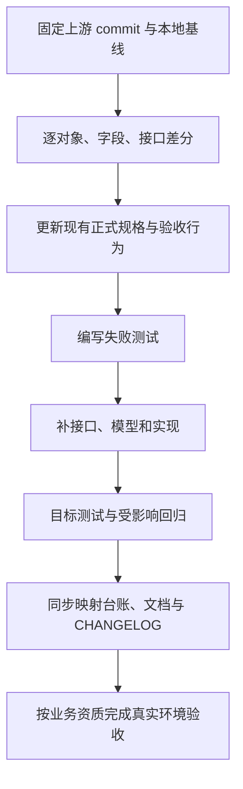

# WxRust 更新核查报告

> 后续实施说明（2026-10-06）：本文保留 10 月 5 日只读核查时的结论。四项能力已进入实现与验收，当前状态和本次实测证据见 [实施验证报告](wechat-upstream-implementation-2026-10-06.md)，不得把下文的“未实现/未验证”当作本次最终状态。

核查日期：2026-10-05（Asia/Shanghai）
本地基线：`main`，HEAD `260d800`，workspace `0.1.4`，MSRV `1.89`，Edition `2024`。
性质：源码与文档只读核查；本次仅更新报告，不实施功能、不修改正式规格、不重新运行测试或真实微信联调。

## 1. 结论与证据边界

建议优先核对个人主体虚拟支付新增参数，并补充微信客服知识库和旅客运输行业电子发票；微信小店独立模块应先做兼容性设计。

本地最新提交日期为 2026-09-02。当前可访问的 WxJava develop 提交列表包含至 2026-09-08 的更新，在线 pom 声明 `4.8.6.B`。网页可能存在缓存，本报告不保证覆盖截至核查日的所有上游提交，也不宣称存在新的正式发布版本。

证据分为三类：

- **本次确认**：Git 状态、manifest、CodeGraph 返回的当前源码、目录与文本检索。
- **历史记录**：CHANGELOG、验证报告、Alpha 报告中的测试数、覆盖率与联调结论；未在本次重新执行。
- **待核实**：未取得完整 diff 的上游参数变化、全量接口覆盖、发布结果、当前安全审计结果。

## 2. 已有更新：避免重复实施

| 日期 / 版本 | 已记录的内容 | 证据与限制 |
|---|---|---|
| 2026-09-02 / 0.1.4 | XPay 新增订阅系列 4 接口、订单下载 2 接口、iOS 月结账单、管控原因，共 8 接口 | CHANGELOG 与虚拟支付核查报告；不能据此推断后续新增字段均已覆盖 |
| 2026-08-28 / 0.1.3 | MSRV 提升至 1.89；quick-xml、x509-cert、md-5、redis、criterion 等升级；修复管线错误上抛回归 | manifest 与 CHANGELOG；本次未重新构建 |
| 2026-08-28 / 0.1.1–0.1.2 | 业务接口、测试、CI/CD 和发布准备补充 | CHANGELOG；发布准备提交不等同于远端发布成功 |

0.1.4 的 CHANGELOG 记载 `3602 passed / 0 failed`；0.1.1 记载行覆盖率 `70.06%`。这些属于不同时间的历史结果，不能合并为本次实测结论。

## 3. 上游增量与建议

| 编号 | 上游日期 / 变化 | 本地核查 | 建议优先级与交付范围 |
|---|---|---|---|
| U1 | 2026-09-08，#4120：个人主体虚拟支付参数支持，`0174215` | 本地已补 8 接口；本次未成功读取该提交完整 diff，字段覆盖尚不能判定 | P1：取得完整 diff，逐字段比对 bean、serde 名称、可选性、请求序列化及签名测试；不重复新增已有接口 |
| U2 | 2026-09-05，#4118：微信客服知识库接口，`c1591ba` | 当前 `WxCpKfService` 源码及客服 API 检索未发现知识库能力；此为初步缺口，仍须确认上游实际承载服务与模型 | P1：补接口、实现、bean、URL、装配入口与请求响应测试 |
| U3 | 2026-09-01，#4116：旅客运输行业电子发票，`474f4c7` | 当前 `PartnerInvoiceService` 未定义对应行业开票方法 | P1：补 PassengerTransport 请求模型、trait/impl、敏感字段处理边界、路径/请求体/golden/错误测试 |
| U4 | 2026-08-31，#4117：微信小店独立模块，`230ed0a` | 上游 pom 包含 `weixin-java-store`；本地没有独立 store crate，小店能力仍主要由 channel 承载 | P2：先建立对象与接口映射，评估是否新增 crate；若拆分，应保留旧路径兼容并明确弃用策略 |

优先级为本报告建议，未改变已确认需求或验收标准。U1/U2/U4 的完整迁移范围需要上游 diff 后才能冻结；U3 已取得上游提交页的代码变化。

上游来源：

- [WxJava develop 提交记录](https://github.com/binarywang/WxJava/commits/develop/)
- [个人主体虚拟支付参数提交](https://github.com/binarywang/WxJava/commit/017421583aca8017aff5c5a1ba79fe58fd006bc2)
- [微信客服知识库提交](https://github.com/binarywang/WxJava/commit/c1591bae9c041ab82914d9129c10ee8cb08f9997)
- [旅客运输电子发票提交](https://github.com/binarywang/WxJava/commit/474f4c7a0fc549032efad3c029fa9a981bd82f9a)
- [当前上游 pom](https://raw.githubusercontent.com/binarywang/WxJava/develop/pom.xml)

## 4. 项目状态纠偏

### 4.1 真实消息联调已经有后续闭环记录

2026-08-27 的旧收口报告将真实微信测试列为凭证阻塞。后续 Day-5、CHANGELOG 与 `docs/known-issues.md` 已记录订阅消息、客服消息送达和 token 等链路验证。应使用后续记录更新当前状态，不能继续将小程序消息联调整体列为未启动。

但 Day-5 自身仍混有占位 openid 阶段与送达闭环阶段的文字，末尾还保留“真实 openid 送达验证 PENDING”。需要整理历史阶段与最终结论；本报告不重新解释其成功率或 P99 数值，不复制用户标识和凭证。

### 4.2 Beta/Stable 准出仍缺报告证据

`day-7-observation-report.md` 仍是空模板。观察期日期已经过去，不代表观测数据已采集或准出门禁已通过。当前只能判定：**本次未找到已填充的 Day-7 准出证据**。

待补：实际观察区间、滚动指标、预期错误与非预期失败分类、资源指标、门禁输出以及准出决策。

### 4.3 支付真实商户端到端仍未验证

`docs/known-issues.md` 仍将真实下单、回调、退款、对账单下载列为未验证。小程序消息送达不能替代支付场景验收。

### 4.4 文档与实际架构存在差异

- README 仍使用旧版本/MSRV，应与 `0.1.4` / `1.89` 同步。
- `wx-rust` 仍是占位 crate，尚未提供 README 描述的 feature 门控重导出。
- open 实际依赖 common、mp、miniapp；README 的业务 crate 互不依赖描述应修正。
- 根目录与 docs 下各有 known-issues，覆盖率、联调和发布状态存在不同时间口径，建议确定当前状态入口，并给历史记录添加日期与后继报告引用。
- 历史镜像率先有 `46.8%`，后续记录为 `100.8%`（383/380，含统计口径说明）；不得沿用旧缺口数字，也不得把统计比率等同于全部行为验证。

## 5. 源码侧后续核查项

以下是本次 CodeGraph 源码观察，尚未新增复现测试；与上游新功能分开跟踪。

| 编号 | 源码事实 | 待验证或改善方向 |
|---|---|---|
| A1 | 小程序当前 appid 使用线程局部持有器 | 验证异步任务迁移及同线程交错时的租户隔离，评估显式配置或任务级上下文 |
| A2 | 公共管线 token 失效时标记缓存过期，当次重放沿用旧 token | 对照固定上游版本确认语义；若改为刷新后重放，先更新正式规格和验收用例 |
| A3 | 熔断 HalfOpen 状态继续放行请求 | 验证并发探测是否符合设计中的单探测要求 |
| A4 | 公众号异步路由收尾未等待处理任务句柄 | 验证会话收尾时序，明确完成与取消语义 |
| A5 | 小程序 JSON 路径直接构造 ReqwestTransport，breaker 为 None | 区分“公共基础设施可注入”与“业务门面已装配”；补接入设计与验收 |
| A6 | 支付商户切换修改实例共享配置 | 验证切换与请求之间的并发租户隔离 |

## 6. 建议执行顺序与完成门禁

建议先完成 U1 差分，再按业务需求实施 U2/U3；U4 在兼容方案确认后推进。A1/A6 的租户隔离应优先于扩大共享实例的生产使用范围。

实施时延续项目已有 Superpowers 规格与计划；本报告只是核查证据和待办建议，不是第二套规格事实源。本次不初始化 Spec Kit/OpenSpec，不创建或切换分支。

新功能的完成证据至少应包含：明确的上游 commit/官方接口基线、可观察验收行为、目标失败测试与修复后结果、受影响回归、装配入口和兼容性检查。涉及商户资质的功能应区分 Mock 验证与真实环境验证。

## 7. 本次验证与交付

- CodeGraph 初始化完成：3,814 文件、37,426 节点、89,990 关系；状态查询为最新。
- 初始化前与本次文档更新前 Git 工作区干净；`.codegraph/` 已在忽略规则中。
- 已读取相关源码、manifest、CHANGELOG、已知问题和 Alpha 报告，并核对可访问的上游网页。
- 本次未运行 cargo check/test/clippy/coverage/security audit，未执行发布或真实微信调用。
- 本次交付为更新报告及旧收口报告的后继引用；业务源码与正式规格保持不变。

本地参考：[CHANGELOG](../../CHANGELOG.md)、[虚拟支付核查](wxpay-doc-alignment-and-virtual-payment-2026-09-02.md)、[当前已知问题记录](../known-issues.md)、[Day-5](../operations/alpha-2026-q3/day-5-observation-report.md)、[Day-7 模板](../operations/alpha-2026-q3/day-7-observation-report.md)。
