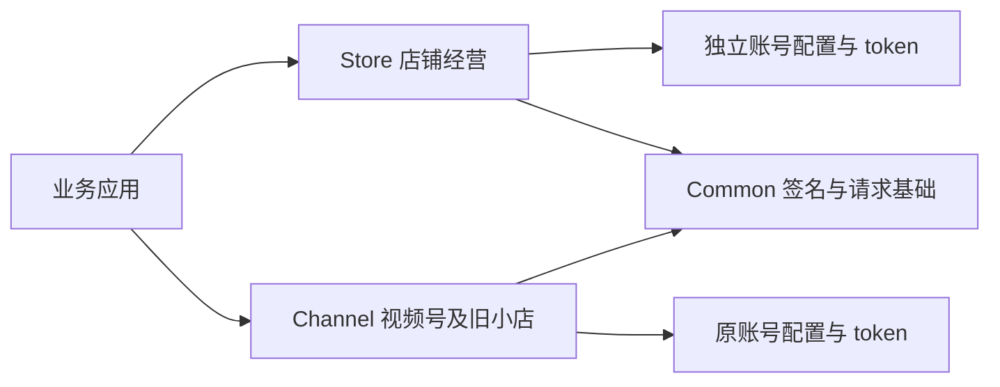

# 四项微信能力接入与迁移

当前规格事实源是 `openspec/specs/` 下的四份主规格；本次变更记录在 `openspec/changes/archive/2026-10-06-complete-wechat-upstream-capabilities`。固定 WxJava 基线：个人虚拟支付 `017421583aca8017aff5c5a1ba79fe58fd006bc2`，客服知识库 `c1591bae9c041ab82914d9129c10ee8cb08f9997`，旅客发票 `474f4c7a0fc549032efad3c029fa9a981bd82f9a`，微信小店 `230ed0a696855dc50a954331d8c0a023f15b3b0b`。

## 个人主体虚拟支付

从 `wx_rust_miniapp::bean::xpay` 导入 `WxMaXPayRequestVirtualPaymentRequest` 与 `WxMaXPaySigParams`，调用请求的 `create_pay_data`；已有 XPay 服务也提供 `create_request_virtual_payment_data`。这个步骤只计算前端参数，不发送请求。

请求字段依次为 offerId、buyQuantity、env、currencyType、productId、goodsPrice、outTradeNo、attach。`None` 省略，显式空串保留。`signData` 是最终签名原文：交给前端时不要解析后重新排序或重新编码。`paySig` 使用 appKey 签名 `requestVirtualPayment&{signData}`，`signature` 使用 sessionKey 签名原始 signData；模式为 `short_series_goods`。

appKey/sessionKey 仅保存在服务端。金额单位为分；商品、数量和环境需要由业务校验。错误通过 `WxErrorException` 返回。发货通知的 `OutTradeNo`、`WeChatPayInfo.MchOrderNo`、`GoodsInfo.ProductId/Quantity` 已接入 JSON 和 XML 解析；业务仍需做签名校验、订单比对和幂等发货。

可编译示例：`crates/wx-rust-miniapp/examples/personal_virtual_payment.rs`。

## 企业微信客服知识库

在现有 `WxCpService` 客户端上导入扩展 trait `WxCpKfKnowledgeService`，即可使用已有配置、认证、重试和错误机制。旧 `WxCpKfService` 的必需方法未增加，自定义实现继续可用。

| 方法 | 接口 |
|---|---|
| add_knowledge_group | POST /cgi-bin/kf/knowledge/add_group |
| del_knowledge_group | POST /cgi-bin/kf/knowledge/del_group |
| mod_knowledge_group | POST /cgi-bin/kf/knowledge/mod_group |
| list_knowledge_group | POST /cgi-bin/kf/knowledge/list_group |
| add_knowledge_intent | POST /cgi-bin/kf/knowledge/add_intent |
| del_knowledge_intent | POST /cgi-bin/kf/knowledge/del_intent |
| mod_knowledge_intent | POST /cgi-bin/kf/knowledge/mod_intent |
| list_knowledge_intent | POST /cgi-bin/kf/knowledge/list_intent |

列表查询中可选参数为 `None` 时省略，`Some("")` 保留空串。`has_more` 为整数；继续翻页时传 `next_cursor`，同时防止空游标或重复游标造成死循环。问答支持顶层字段和 question 包装，以及文本、图片、视频、链接、小程序附件。业务错误、解析错误和传输错误均沿用 `WxErrorException`。

可编译分页示例：`crates/wx-rust-cp/examples/kf_knowledge.rs`。

## 旅客运输行业电子发票

在现有 `WxPayService` 上导入 `PassengerTransportInvoiceService`，调用 `issue_passenger_transport_invoice(&request)`。原 `PartnerInvoiceService` 的自定义实现不需要新增必需方法。

请求发送到 `/v3/new-tax-control-fapiao/fapiao-applications/issue-passenger-transport`。模型包括发票信息、发票行、旅客信息和交易信息；金额、数量等 Java Long 字段为 i64，负折扣金额保留。缺省旅客信息使用 Option。

手机号、邮箱和证件号必须由调用方按微信支付当前平台公钥进行预加密，并配置与该公钥匹配的 `Wechatpay-Serial` 标识。本接口原样透传密文，不做二次加密。沿用 V3 商户签名和支付错误机制。`202 Accepted` 空响应表示受理成功，不能据此标记开票完成；持久化申请单号和发票单号，再使用现有发票查询/通知流程确认最终结果。

可编译提交示例：`crates/wx-rust-pay/examples/passenger_invoice.rs`。示例不会执行真实开票。

## 微信小店独立模块

新增 `wx-rust-store`，SDK 依赖只有 `wx-rust-common`，不依赖 Channel。应用另行声明 tokio 等运行时依赖。默认配置、token 缓存和子服务属于各客户端实例，支持不同账号并发使用。

| 原 Channel 名称 | Store 名称 |
|---|---|
| wx-rust-channel | wx-rust-store |
| WxChannelService / WxChannelServiceImpl | WxStoreService / WxStoreServiceImpl |
| WxChannelConfig / WxChannelDefaultConfig | WxStoreConfig / WxStoreDefaultConfig |
| WxChannelOrderService | WxStoreOrderService |
| WxChannelProductService | WxStoreProductService |
| WxChannelAfterSaleService | WxStoreAfterSaleService |

Store 装配 26 个经营子服务：地址、售后、基础、品牌、类目、店铺罗盘、合作、优惠券、电子面单、收藏、运费模板、资金、赠品、主页、客服、限时折扣、订单、商品助手、商品、库存、质检、分享员、供应商、会员、仓库、带货助手。商品服务也提供上游要求的赠品与限时折扣入口。

上游协议仍使用 `/channels/ec/...` 地址，模块独立不会改变微信的端点。Store 不提供视频号直播、独立 Finder、联盟、留资或达人罗盘服务；这些业务继续使用 Channel。店铺罗盘中的商品与经营数据仍属于 Store。

旧 Channel 导入、配置和真实实现保留。建议按业务域逐步迁移，先切换订单，再切换商品或售后。新旧模型是独立 Rust 类型，不能直接赋值；逐字段转换可以显式控制默认值和新增字段。Store 经营模型的可空字段使用 Option：None 省略，Some(空串) 保留；从旧 Channel 的默认字符串迁移时，由业务方明确选择 None 或 Some，而不是自动丢弃空串。不要通过共享全局 token 缓存混用账号，也不要假设两个模块的数据结构永久相同。

经营查询示例：`crates/wx-rust-store/examples/operations.rs`，展示商品详情、地址分页、订单与物流公司、售后详情及账户余额查询。修改、退款、提现等写操作应由业务方在确认业务状态与权限后调用对应子服务，不能按查询示例直接批量执行。

Store 初始化示例：`crates/wx-rust-store/examples/shop.rs`。独立认证与店铺调用工程：`tests/fixtures/store_consumer`。双模块编译与显式类型转换工程：`tests/fixtures/channel_store_consumer`。

## 验证边界

离线测试验证请求路径、字段、响应解析、业务错误和认证隔离。微信业务权限、真实商户密钥、生产发票受理及店铺线上行为仍需在接入方的测试账号环境联调。发布流程已纳入 Store；本次不执行 crates.io 发布或真实交易。

上游固定版本的 `closeOrder` 本身未接入端点，返回内部错误 -99；Store 保留该可观察行为，不能把它作为可执行的关单能力。Java HTTP 后端使用 reqwest 适配，Redis/Redisson 配置不作为本次独立 Store 后端提供。

## 本地 Redis 验收

真实 Redis 集成测试可使用 REDIS_URL 连接已启动的隔离测试服务（例如本地 Docker 的回环 TCP 端口），随后执行 `cargo test -p wx-rust-common --features redis --test redis_integration_test`。Linux CI 也可通过 REDIS_SERVER_BIN 指定 /usr/bin/redis-server，继续使用自动临时 Unix socket 模式。测试使用随机键前缀，不清空外部数据库，外部服务由调用方管理。
