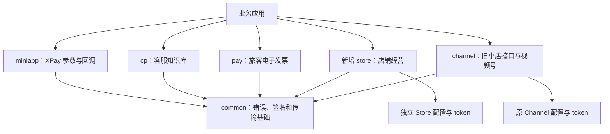
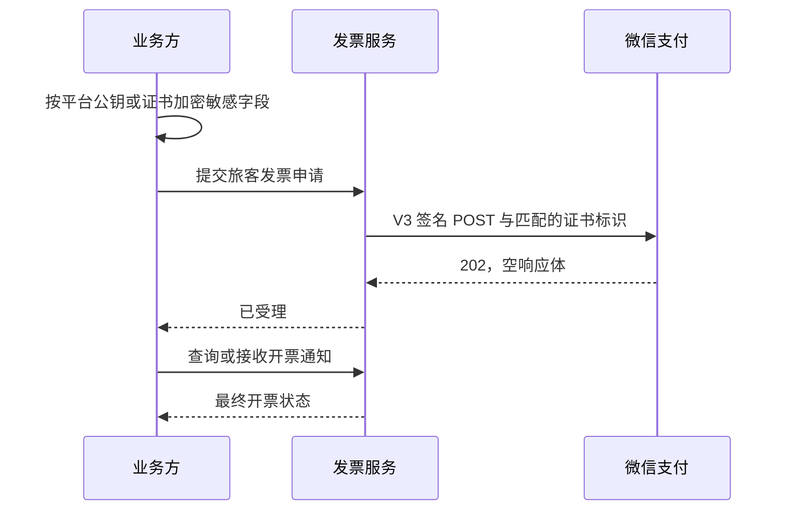

# Design

## Context

动机与固定上游提交见 [proposal](proposal.md)。本地为已发布接口的 Brownfield 项目，版本 0.1.4、MSRV 1.89。CodeGraph 已初始化；源码确认 XPay、企业微信客服、服务商发票和 Channel 已存在，不另造认证栈。此前报告与 Superpowers 产物保留，不作为本增量第二份规格源。

本设计覆盖四项完整实施。OpenSpec 的 planning complete 只说明文档齐全，不代表实现、测试或发布完成。

## Goals / Non-Goals

**Goals:** 新增能力沿用已有配置、错误类型和异步调用约定；协议参数和上游字段可追溯；新旧 Channel/Store 可并存；每个完成项都有实际行为验证。

**Non-Goals:** 不重构整个工作区的 token、重试、断路器或账号上下文；不接入真实商户自动开票；不移植 Java 框架容器；不自动发布版本。若新能力暴露阻断性公共缺陷，仅修复必要路径并补回归证据，不扩大为全库重构。

## Decisions

### 1. 四条业务线共享底层能力，Store 与 Channel 独立

不选择 Store 依赖 Channel 的快捷封装：该方案无法满足独立依赖契约。也不将整个 Channel 复制为 Store：会误暴露视频号专属业务。按照固定上游 Store 树逐对象迁移，允许复用 common 中已存在的通用机制；新旧业务模型保持独立类型，沿用上游迁移边界，避免重导出带来的类型身份变化。成本是暂时维护两套经营适配层，以请求等价测试防止漂移。

### 2. U1：本地支付数据生成，不再新增重复网络下单接口

目标位置为 miniapp 的 `bean/xpay`、`api/wx_ma_xpay_service.rs` 与消息模型/解析路径。新增四个 Java 对应模型：

| Java 对象 | Rust 文件 / 主要字段 |
|---|---|
| WxMaXPayRequestVirtualPaymentRequest | wx_ma_x_pay_request_virtual_payment_request.rs；offer_id、buy_quantity、env、currency_type、product_id、goods_price、out_trade_no、attach |
| WxMaXPayRequestVirtualPaymentData | wx_ma_x_pay_request_virtual_payment_data.rs；mode、sign_data、pay_sig、signature |
| WxMaXPayGoodsInfo | wx_ma_x_pay_goods_info.rs；product_id、quantity |
| WxMaXPayWeChatPayInfo | wx_ma_x_pay_we_chat_pay_info.rs；mch_order_no |

请求与前端输出使用 camelCase serde 名称；回调使用上游 PascalCase JSON/XML 名称。金额/数量保留整数，Java nullable 对应 Option；不擅自将 env=0/CNY 写成调用方不可改变的强制值。明确文档约束，不增加未经上游确认的本地业务拒绝规则。

`create_request_virtual_payment_data` 及请求自身生成方法使用同一纯计算实现。按结构字段定义次序序列化一次，直接使用原字节完成两次签名；禁止先转无序映射或将 JSON 二次编码。使用已有 XPay 签名工具，测试必须通过 specs 中的中文 golden 向量。

消息新增 out_trade_no、we_chat_pay_info、goods_info 均可缺省；单独验证 JSON 与 XML 路径，避免只给 serde JSON 增加字段而遗漏 XML 手工解析器。

### 3. U2：在现有客服入口扩展八个方法

目标为 cp 的 `api/wx_cp_kf_service.rs`、对应实现和 `bean/kf` 模型；使用现有服务的 post/config URL 机制。无需新增独立客户端、token 缓存或装配入口。

| Rust 方法 | POST 路径尾部 | 请求要点 | 返回 |
|---|---|---|---|
| add_knowledge_group | add_group | group | group_id + base response |
| del_knowledge_group | del_group | group_id | base response |
| mod_knowledge_group | mod_group | group | base response |
| list_knowledge_group | list_group | cursor、limit、group_id 可缺省 | group_list、next_cursor、has_more |
| add_knowledge_intent | add_intent | intent | intent_id + base response |
| del_knowledge_intent | del_intent | intent_id | base response |
| mod_knowledge_intent | mod_intent | intent | base response |
| list_knowledge_intent | list_intent | 上述列表参数及 intent_id | intent_list、next_cursor、has_more |

路径统一前缀 `/cgi-bin/kf/knowledge/`。新增 WxCpKfKnowledgeGroup、GroupAddResp、GroupListResp、Intent、IntentAddResp、IntentListResp 六个顶层模型；Question、SimilarQuestions、Answer、Attachment、Text/Image/Video/Link/MiniProgram 是对应 Java 内部类型，可与父类型同文件。所有序列化名 snake_case，is_default/has_more 保留整数，不能擅自收窄成 bool。

Question.text、SimilarQuestions.items、Answer.text/attachments 及问答顶层/Question 内嵌的 similar_questions/answers 都要保留。附件 msgtype 与各 payload 可选字段沿用上游，暂不采用严格封闭 enum，以免拒绝新 msgtype。缺省参数省略，空字符串与未提供区分；通过原错误路径传播 errcode。

### 4. U3：新增独立行业模型与开票方法

新增 `bean/invoice/passenger_transport_invoice_request.rs`，对应 PassengerTransportInvoiceRequest；其四个 Java 内部类可同文件并使用明确的 Rust 类型名，复用已有 BuyerInformation。新增 `issue_passenger_transport_invoice`，复用 PartnerInvoiceServiceImpl 的 weak service 与支付 V3 路径。

| 层次 | 完整字段 |
|---|---|
| 根请求 | sub_mchid、fapiao_apply_id、buyer_information、fapiao_information |
| FapiaoInformation | fapiao_id、total_amount、items、export_business_policy_code、vat_refund_levy_code、billing_person_id、billing_person、fapiao_bill_type、transaction_information、remark |
| InvoiceItem | tax_code、goods_name、specification、unit、quantity、total_amount、tax_rate、discount、preferential_policy_code、passenger_information |
| PassengerInformation | name、certificate_type、certificate_number、departure_date、departure_place、destination、transportation_type、transportation_classes |
| TransactionInformation | pay_channel、transaction_id、out_trade_no、amount |

Java Long 使用 i64，Boolean 使用 bool，nullable 使用 Option。中文 doc 保留单位、长度、枚举值语义：数量 1 对应 100000000、税率万分之一、金额分；单票最多八行、最多十笔交易、301 开头税码、SHIP 舱位条件、两种交易单号至少一项等。保持上游的请求建模职责；不把完整税务业务校验硬编码到 SDK。

发往 `/v3/new-tax-control-fapiao/fapiao-applications/issue-passenger-transport`，返回 `Result<(), WxErrorException>`。不解析成功空体，202 仅表示受理。调用方预加密 phone/email/certificate_number，透传且不打印；实施时检查支付 V3 helper 是否发送与加密依据匹配的 Wechatpay-Serial，若普通 post_v3 不满足，则沿用现有带 serial helper 并写集成测试，不能仅根据 Java 调用名推断安全性。

### 5. U4：固定基线全量清单驱动独立 Store 实现

当前仅取得大型提交前 300 个文件，不把它当作完整迁移清单。实施第一步读取固定提交中 `weixin-java-store` 的完整 Git tree；若 API 分页/递归树被截断，按子树读取并核对 truncated 标志。生成版本化覆盖清单：Java 路径/类型/公开方法、Rust 路径/类型/方法、协议路径、测试、状态。只有清单全部验证才算 Store 完成。

创建 `crates/wx-rust-store`，使用 workspace 版本、lint、MSRV；新增 workspace dependency，沿用既有 feature 设计且独立构建。依次实现 bean/enum/config、WxStoreService/Impl、全部经营子服务、公开导出、路由/消息能力（以固定上游模块公开树为准）。真实逻辑置于对应文件；lib.rs/mod.rs 只声明与重导出，不以 compat.rs 集中所有对象。

Java `com.binarywang.wxjava.store` 映射为 Rust Store 命名空间；来源注释准确指向 Store，不能保留错误的 Channel 类名。经营端点仍按上游协议调用，不机械将 URL 的 channel 字样改为 store。Store 不依赖 Channel 的测试辅助类型，测试基建可置于本 crate tests。

Channel 保持现有类型与实现。仅对有 Store 对应的小店入口提供带迁移说明的弃用提示；不批量弃用直播/Finder/联盟/留资/罗盘。示例展示独立依赖、双客户端共存和模型显式转换。检查 README、发布脚本、CI 中显式 crate 枚举，全部加入 Store；不顺带重构尚为空壳的 wx-rust 总门面。

### 6. 公共接口兼容策略与验证方法

新增方法优先提供可工作的 trait 默认实现，复用已有调用原语；不新增空体、todo 或 unsupported stub 来保持编译。若现有 trait 不能提供可工作的默认实现，应采用扩展 trait 并为现有实现提供真实实现，保留旧下游自定义实现可编译；补编译 fixture 验证。对新增公开结构字段的 Rust struct literal 兼容影响在迁移文档明确说明，不宣称所有源码零改动。

每个能力按“失败行为测试 → 最小实现 → 目标测试 → 受影响回归”执行。断言真实 HTTP 方法、路径、body、header、错误，不只断言函数存在或 HTTP 200。网络模拟只使用本机，凭证与个人数据为固定虚构样例；实际支付/开票不自动执行。

| 能力 | 最低行为证据 |
|---|---|
| U1 | 固定签名向量、缺省字段、JSON/XML 回调、旧 XPay 回归 |
| U2 | 八条路径和请求体、空过滤条件、两页游标、附件/嵌套形态、errcode/坏 JSON/网络失败 |
| U3 | 全字段 golden、大整数/负数、202 空体、V3 签名与 serial、密文透传、错误和旧查询回归 |
| U4 | 完整公开方法清单、独立 consumer、依赖树、服务装配、经营请求、双账号隔离、Channel 旧例回归和打包 |

最终运行受影响 crate 测试、workspace fmt/check/clippy/test、MSRV 检查及仓库要求的 CI 门禁。报告记录命令、时间、退出码及失败原因；不挪用历史的 3602 tests 或 70.06% 覆盖率作本次证据。

## Risks / Trade-offs

- [上游体量大、列表截断] → 用固定树清单完整核对；不能按已有 300 文件自称全量覆盖。
- [双套经营适配器漂移] → 保持协议基线、增加 Channel/Store 请求等价回归，后续抽取共性作为独立变更。
- [签名 JSON 顺序和编码差异] → 使用同一序列化结果及上游 golden；禁止中间改写。
- [202 被误当开票成功] → API 返回单位值并在文档/示例明确查询最终状态。
- [共享 mutable 配置导致串号] → Store 使用独立配置；双客户端/并发测试覆盖已知风险，发现当前新增路径问题不得忽略。
- [新增公开字段影响 struct literal] → 文档提示默认构造/Builder；提供旧接口编译与行为回归，评估版本说明。
- [缺乏真实商户环境] → 离线验收可完成；真实联调单独列为未执行，不伪造证据，不阻塞无凭证的代码交付。

## Migration Plan

1. 固定四项映射及测试样例；读取当前文件确认未提交改动，保持当前分支。
2. 顺序实现 U1、U2、U3，每项跑完目标回归再推进。
3. 按完整清单实施 U4；先独立 Store，再 Channel 兼容文档/提示和双依赖测试。
4. 执行全工作区门禁、包检查和规格逐场景核验，更新报告、CHANGELOG、迁移指南。
5. 全部实施验证完成后才同步主规格和归档；未完成任务保持未勾选。发布另行授权。

回退通过撤回本变更提交或回退依赖版本进行，不删除旧 Channel；Store 迁移可逐业务退回旧调用方入口。无数据库变更，不需要数据迁移。仅撤回本变更拥有的内容，保护用户现有修改。

## 实施细化

知识库使用 `WxCpKfKnowledgeService: WxCpService` 扩展 trait；旅客发票使用 `PassengerTransportInvoiceService: WxPayService` 扩展 trait。两者通过 blanket impl 提供已有客户端入口，旧 Kf/PartnerInvoice trait 不增加必需方法。调用方显式导入扩展 trait。支付 V3 底层补充 `202 Accepted` 成功分支，沿用原错误与签名路径。

## Store 空值语义收口

独立 Store 经营模型采用 Option 表示缺省字段；与旧 Channel 的默认字符串/数值模型是独立类型。None 序列化省略，Some(空串/零) 保留，服务将确实提供的必需参数包装为 Some，可选参数不强制默认零。协议错误码与错误信息由 Rust 基础响应适配层保留既有默认值；消息基类已有 Option 和 NON_NULL 输出路径。425 个固定 Java 引用字段空值测试与 433 个完整字段 fixture 同时验证，避免只验证存在字段而漏掉缺省行为。

## 验收环境接入

Redis 集成测试支持显式 REDIS_URL，连接调用方提供的本地真实测试 Redis，不自动安装或拉取服务；默认仍按 REDIS_SERVER_BIN 启动临时 Unix socket Redis。已有测试保留随机键隔离、真实 TTL 与原子去重断言。外部连接不由测试 Drop 关闭或清空数据库。Linux CI 显式使用 /usr/bin/redis-server，避免默认 Homebrew 路径造成环境失败。
